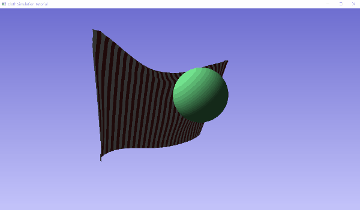
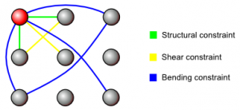
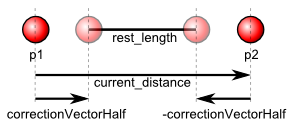

# ClothSimulation

采用Verlet积分法来模拟物理，例如布料的重力。

# 粒子约束

布料现在采用了三种约束（constraints）：

约束对粒子的运动影响如下：

每次满足约束迭代将p1移向p2或远离p2，移动的向量为：

 $\vec{correctionVectorHalf} $ = $\vec{p1p2}$* (1 - rest_length/|$\vec{p1p2}$)|)*0.5 。

p2的移动向量相反，为-$\vec{correctionVectorHalf} $ 。

# 碰撞

在每次物理模拟的时候，检测衣服的所有粒子，看是否有粒子的位置与球的中心的向量小于球的半径，小于则将粒子沿球中心到粒子位置方向移到球的表面。

# References

https://viscomp.alexandra.dk/?p=147